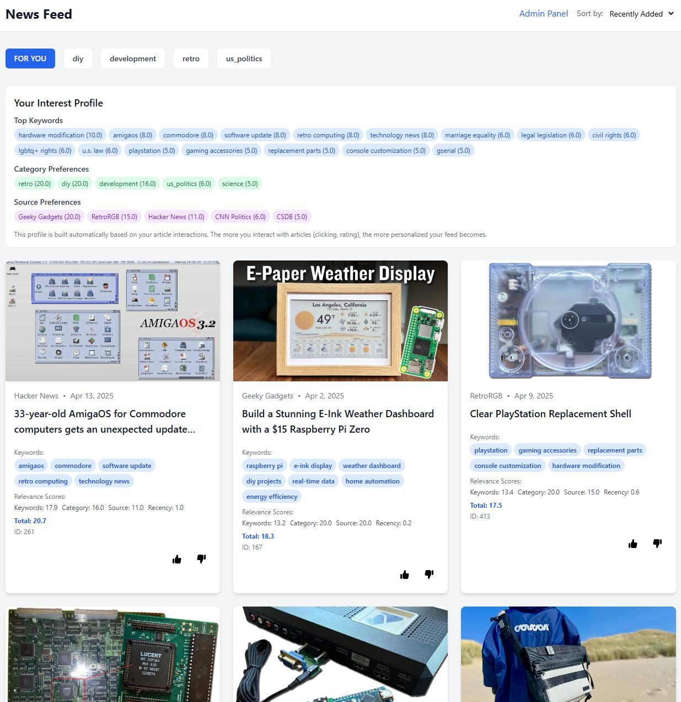

# NewsFeedSolo

**IMPORTANT NOTE: This is currently a Proof of Concept (POC) project intended to demonstrate the feasibility of automated news collection and analysis. It is not intended for production use without further development and hardening.**

A full-stack Node.js application for collecting, analyzing, and serving news articles from RSS feeds. This application parses OPML files containing RSS feed URLs, fetches articles, extracts the main content, performs keyword analysis, and serves content through a REST API with a Vue.js frontend.

## Screenshot



## Current State

This project is a Proof of Concept that demonstrates:
- Automated news collection and content extraction
- Implementation of keyword-based content profiling
- Dynamic recommendation system based on user interactions
- Simple web interface for content browsing

While functional, some areas would need further development for production use:
- Enhanced error handling and recovery
- Improved security measures
- Better scalability for larger article volumes
- Production-grade logging and monitoring
- Additional test coverage

## Features

- **OPML Parsing**: Parse OPML files to extract RSS feed information
- **RSS Feed Fetching**: Fetch articles from RSS feeds
- **Content Extraction**: Extract the main content from article URLs using [@extractus/article-extractor](https://github.com/extractus/article-extractor)
- **Keyword Extraction**: Extract relevant keywords from article content
- **REST API**: Serve articles and recommendations through a REST API
- **Vue.js Frontend**: Browse and interact with articles through a modern web interface
- **Admin Dashboard**: Monitor system statistics and user preference profiles
- **SQLite Database**: Efficient storage and querying of articles and interaction data
- **Dynamic Recommendations**: Personalized article recommendations based on keyword matching and user interactions

## Project Structure

```
NewsFeedSolo/
├── src/                    # Backend source code
│   ├── index.js           # Main collector entry point
│   ├── server.js          # API server
│   ├── database.js        # Database operations
│   ├── opmlParser.js      # OPML file parsing
│   ├── rssFetcher.js      # RSS feed fetching
│   ├── contentFetcher.js  # Content fetching
│   ├── articleExtractor.js # Article extraction
│   ├── keywordExtractor.js # Keyword extraction
│   └── storage.js         # File storage management
├── frontend/              # Vue.js frontend application
│   ├── src/              # Frontend source code
│   │   ├── App.vue       # Main application component
│   │   ├── Admin.vue     # Admin dashboard
│   │   └── main.js       # Frontend entry point
│   └── index.html        # Frontend HTML template
├── opml/                 # OPML feed configuration
│   ├── development.opml  # Development news feeds
│   ├── diy.opml          # DIY project feeds
│   ├── science.opml      # Science news feeds
│   ├── retro.opml        # Retro computing/gaming feeds
│   └── us_politics.opml  # US politics news feeds
├── storage/              # Article storage
│   ├── news.db          # SQLite database
│   └── category/        # Raw article content by category
└── utils/               # Utility scripts
    └── migrate.js       # Database migration tools
```

## Storage Architecture

The application uses an SQLite Database (`storage/news.db`) for:
   - Article metadata and content
   - User interactions
   - Article keywords
   - Recommendation data

## Recommendation System

The application features a keyword-based recommendation system:

- **User Preference Profiles**: Automatically built based on user interactions
- **Time-Decay Algorithm**: Recent interactions have higher weight (30-day half-life)
- **Multifactor Scoring**: Combines keyword matching, category preferences, source preferences, and recency
- **Content Similarity**: Finds similar articles based on keyword overlap

### Recommendation Factors

Articles are scored based on multiple factors:
- **Keyword match (40%)**: How well article keywords match user preferences
- **Category preference (20%)**: User's historical interaction with content categories
- **Source preference (20%)**: User's historical interaction with content sources
- **Recency (20%)**: Newer content receives a boost
- **Direct interaction**: Additional boost for articles directly interacted with

## API Endpoints

- `GET /api/articles` - Get articles with optional filtering
- `GET /api/categories` - Get available article categories
- `GET /api/recommendations` - Get personalized article recommendations
- `GET /api/articles/:id/similar` - Get articles similar to a specific article
- `GET /api/profile` - Get user preference profile
- `POST /api/articles/:id/interaction` - Track user interactions
- `GET /api/admin/stats` - Get system statistics

## Prerequisites

- Node.js 16.x or higher
- npm or yarn
- SQLite 3

## Installation

1. Clone the repository:
   ```bash
   git clone https://github.com/yourusername/newsfeedsolo.git
   cd newsfeedsolo
   ```

2. Install backend dependencies:
   ```bash
   npm install
   ```

3. Install frontend dependencies:
   ```bash
   cd frontend
   npm install
   ```

## Usage

1. Start the backend services:
   ```bash
   # Start the collector and API server
   npm start
   ```

2. Start the frontend development server:
   ```bash
   cd frontend
   npm run dev
   ```

3. Access the application:
   - Frontend: http://localhost:5173
   - API: http://localhost:3000

## Configuration

Configure the application through environment variables or modify the source files:

- `src/index.js`: Collector settings
- `src/server.js`: API server configuration
- `src/database.js`: Recommendation system parameters
- `frontend/vite.config.js`: Frontend build configuration

## License

MIT
